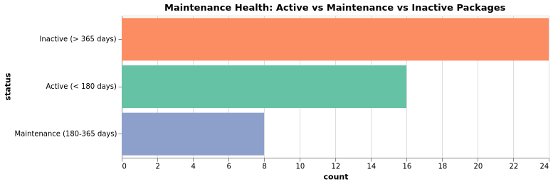
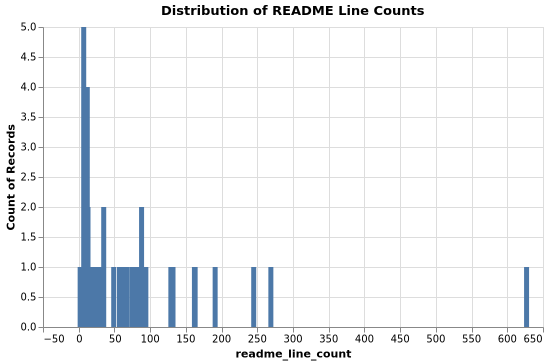

# JuliaHealth Ecosystem Audit Results

## Summary

This comprehensive audit evaluates the **JuliaHealth ecosystem** across various packages and non-package resources, analyzing metrics to assess standards compliance, documentation, infrastructure, community engagement and maintenance health. These findings support the NumFOCUS Small Development Grant objectives.

## Standards & Quality Assessment

### Overall Compliance Overview

### Development Approaches

## Ecosystem Maturity & Structure

### Package Classification

| Tier | Criteria |
|---|---|
| Stable | In General Registry; releases >= 10 |
| Developing | In General Registry; releases >= 1 |
| Early | Not in General Registry OR no releases |

### Registry Integration

## Documentation & CI/CD Infrastructure

### Documentation Coverage Assessment

### CI/CD Automation Status

### Code Coverage & Testing

## Community Engagement & Maintenance

### Maintenance Status

| Status | Criteria |
|---|---|
| Active | Last push < 180 days |
| Maintenance | Last push 180–365 days |
| Inactive | Last push > 365 days |
| Unknown | Timestamp unavailable or unparsable |

### Top Packages by Community Engagement

### Release & Development Activity

### Contributor Patterns

### Repository Activity

## Community Contribution & Issue Management

### Issue & PR Activity

## Licensing & Documentation Accessibility

### GitHub Pages Documentation Accessibility

### README Quality Assessment

## Non-Package Resources Assessment

This section audits supporting resources (documentation sites, tutorials, reference implementations) that enhance the JuliaHealth ecosystem.

### Popularity & Engagement

### Infrastructure Quality

### Activity Status

**Report Generated:** Auto-generated by scripts/visualizations/visualize.jl  
**Data Source:** GitHub API audit of JuliaHealth repositories