# JuliaHealth Ecosystem Audit Results

##  Package Audit Visualizations

### Standards & Quality

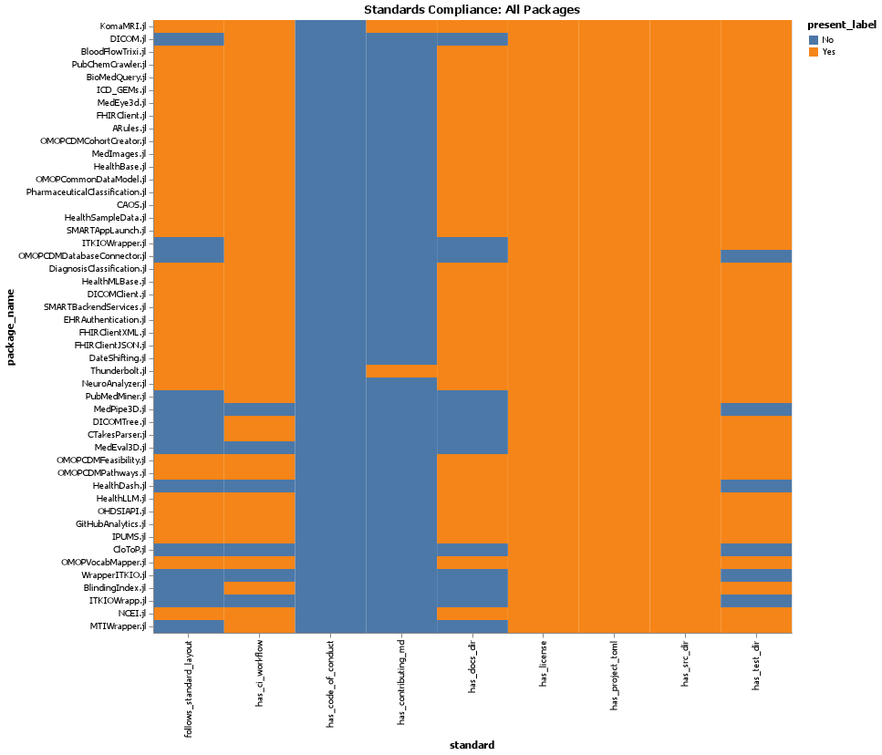

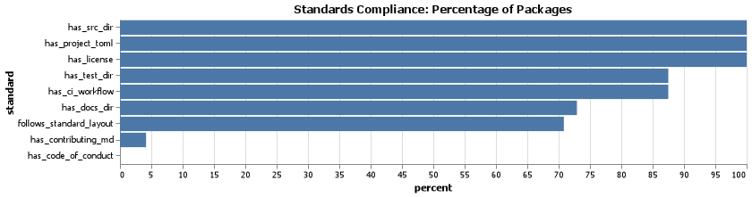

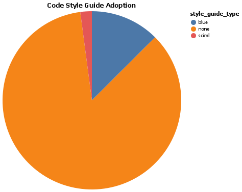

### Community Metrics

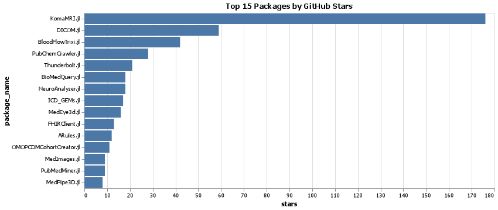

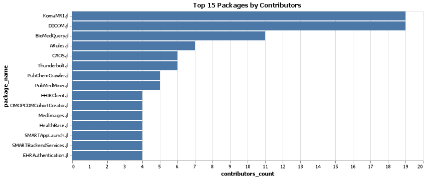

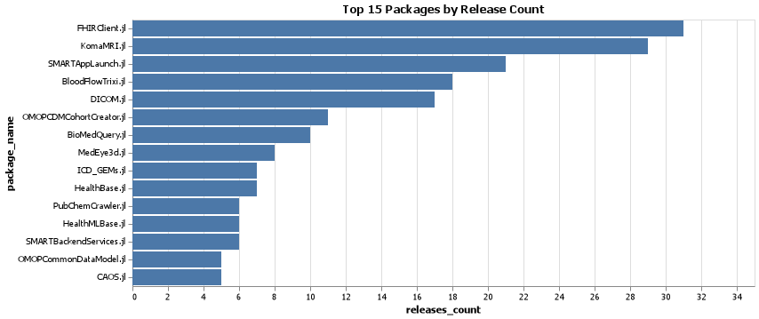

### Documentation

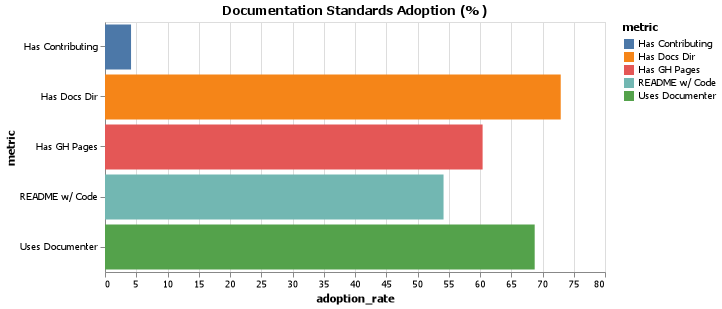

### Infrastructure

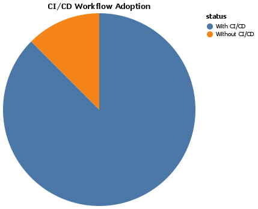

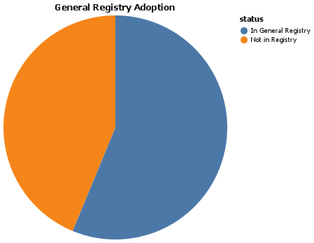

### Distribution Patterns

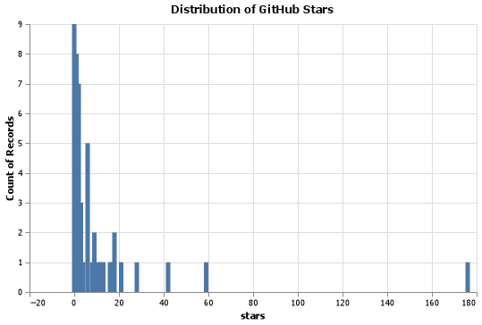

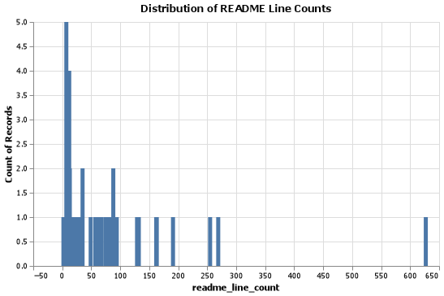

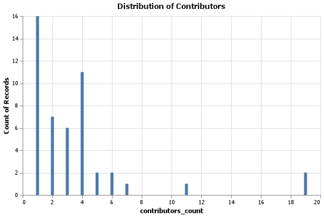

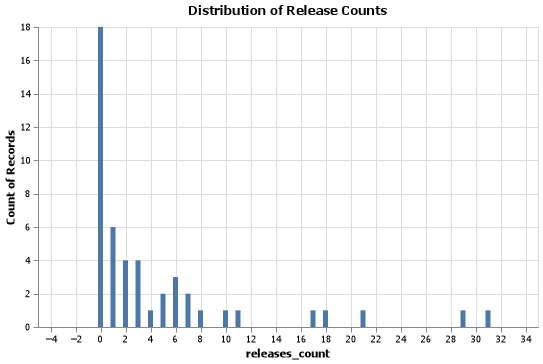

### Project Status

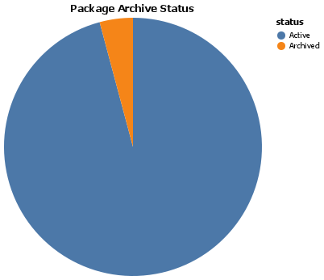

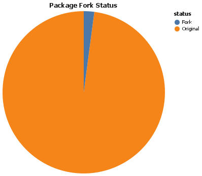

### Community Engagement

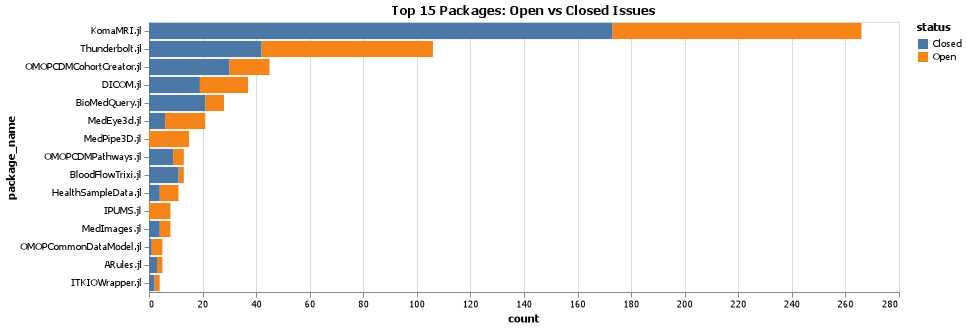

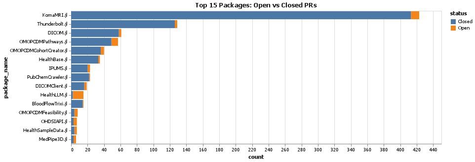

##  Non-Package Audit Visualizations

### Community Resources

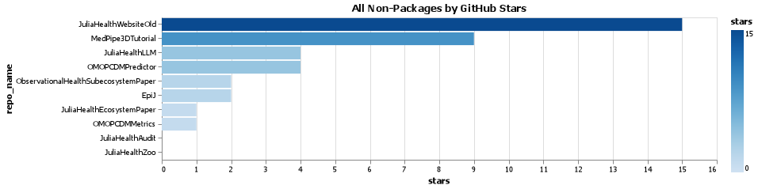

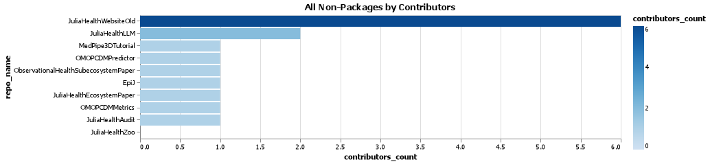

### Resource Status

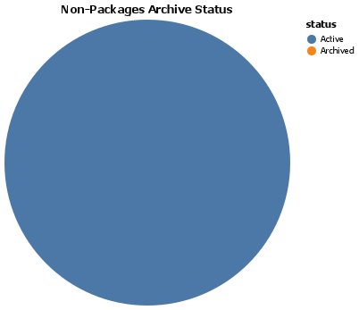

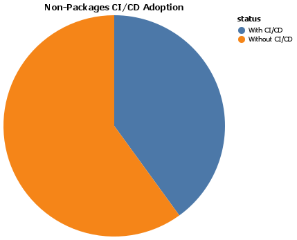

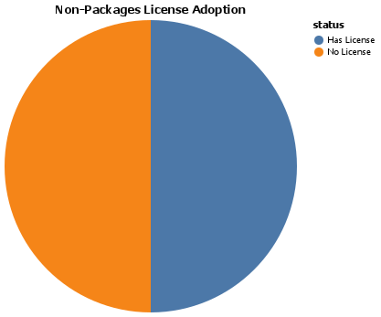

### Support Quality

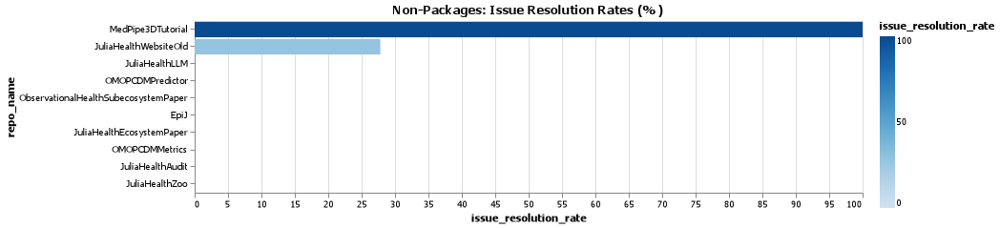

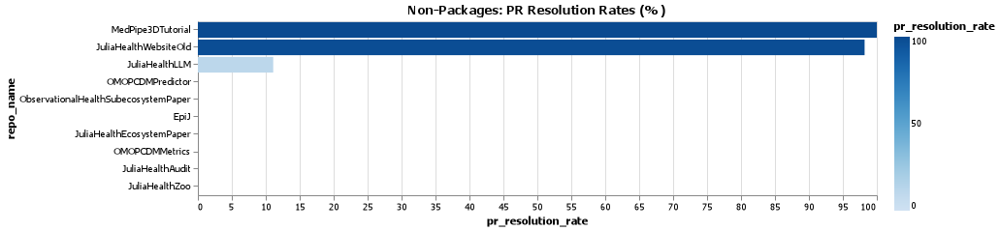

### Activity Status

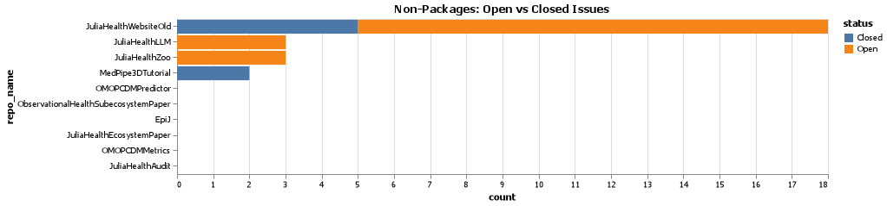

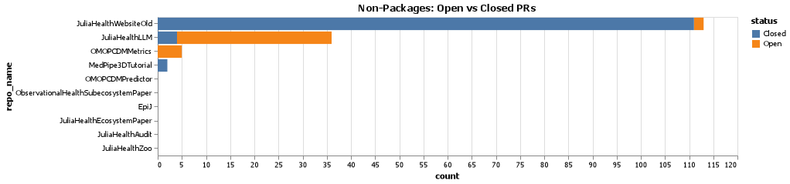

##  Ecosystem Comparison

### Package vs Non-Package Analysis

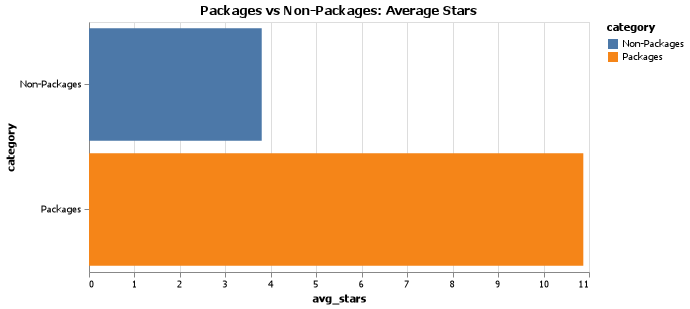

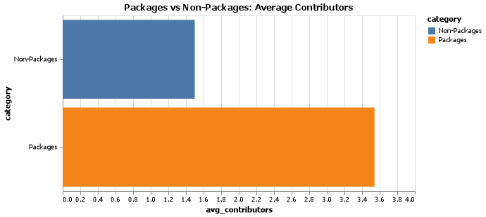

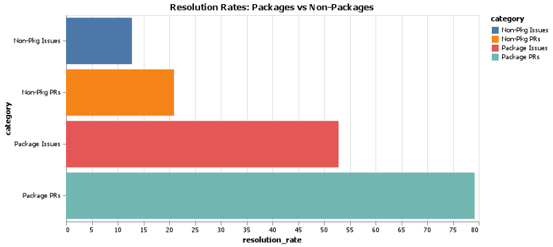

**Report Generated:** Auto-generated by \scripts/visualizations/visualize.jl\  
**Data Source:** GitHub API audit of JuliaHealth repositories
