# JuliaHealth Ecosystem Audit Results

Latest automated audit of JuliaHealth packages, non-package repositories, and cross-ecosystem contributors. All charts are generated by `scripts/visualizations/visualize.jl` from GitHub API data.

## Packages

### Standards & Structure

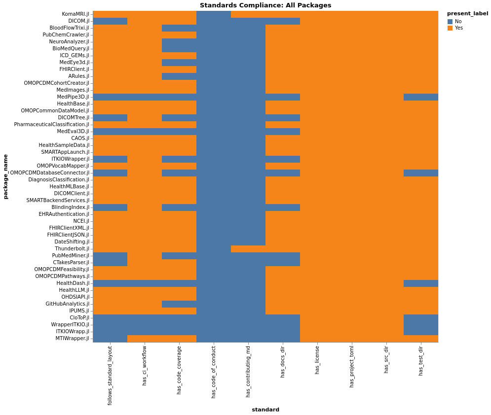

| Feature | Description |
|-------|-------------|
| **follows_standard_layout** | `src/`, `Project.toml`, `LICENSE` required; `test/`, `docs/`, CI, Documenter, and coverage recommended |
| **has_ci_workflow** | GitHub Actions workflow present |
| **has_code_coverage** | Code coverage configuration detected (e.g. Codecov/Codacy or workflow mention) |
| **has_docs_dir** | `docs/` directory exists |
| **uses_documenter** | `docs/make.jl` present (Documenter.jl setup) |
| **has_gh_pages** | `gh-pages` branch exists (deployed documentation) |
| **has_contributing_md** | `CONTRIBUTING.md` present |
| **has_code_of_conduct** | `CODE_OF_CONDUCT.md` present |
| **has_license** | `LICENSE` file present |
| **has_project_toml** | `Project.toml` present |
| **has_src_dir** | `src/` directory present |
| **has_test_dir** | `test/` directory present |

**Standards percentages:** shows adoption rates for each standard across all packages.

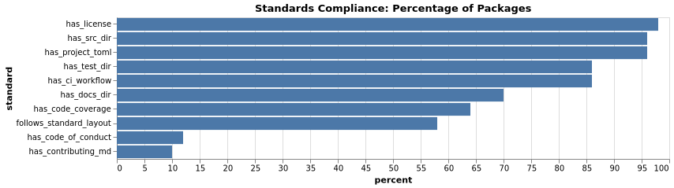

**Style guide:** shows code formatter preference from `.JuliaFormatter.toml` (blue, sciml, default/none, or other). Consistent style improves readability and contribution workflow.

 

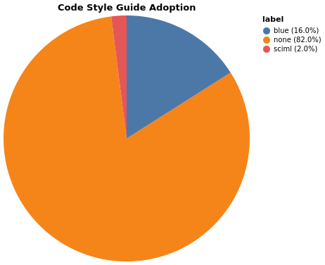

### Registry & Maturity

**General Registry:** the official Julia package index; packages in it can be added via `] add PackageName`. Registry status comes from matching package names (with/without .jl) against the General registry list. Registered packages are discoverable and installable by the wider Julia community.

 

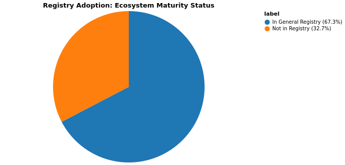

**Maturity tiers criteria:**

| Tier | Criteria |
| --- | --- |
| Mature | In General Registry AND releases_count ≥ 20 |
| Stable | In General Registry AND 5 ≤ releases_count ≤ 19 |
| Early Release | In General Registry AND 1 ≤ releases_count ≤ 4 |
| Registered (No Releases) | In General Registry AND releases_count = 0 |
| Not Registered | Not in General Registry |

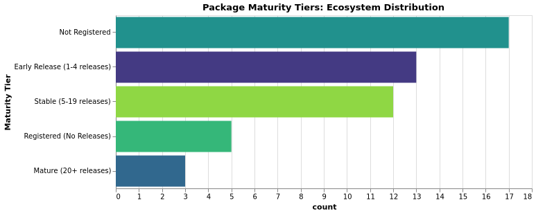
### Documentation & CI/CD

**Docs audit coverage:** combination of docs/ directory, Documenter.jl usage, and gh-pages branch. Good documentation is critical—it's often the first thing users see when evaluating a package.

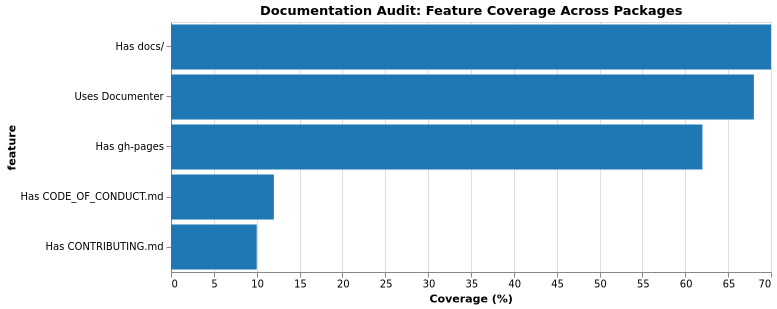

**GitHub Pages adoption:** fraction of packages with deployed, publicly accessible documentation via gh-pages.

 

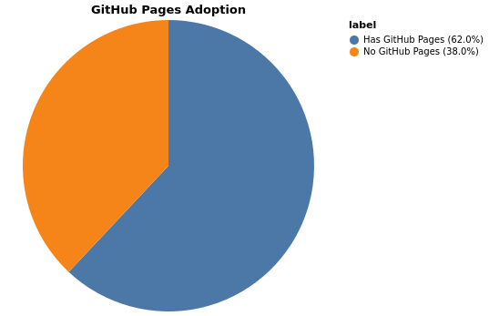

**CI status:** shows distribution of packages with vs without CI workflows. CI automatically runs tests on every code change, catching bugs before they reach users.

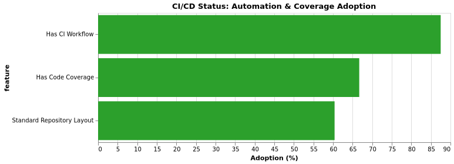

**CI adoption:** share of packages with GitHub Actions workflows for automated testing and quality checks.

 

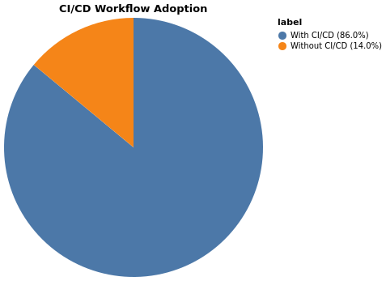

**Code coverage:** fraction with codecov/codacy config or coverage mentions in workflows. Coverage tracking measures what percentage of code is tested; higher coverage means fewer untested edge cases.

 

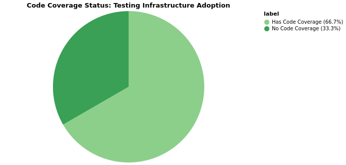

### README Completeness

**README completeness factors:**

- **Install section** — guides users on how to install the package
- **Usage/Examples section** — shows how to use the package with examples
- **Contributing guidance** — explains how to contribute to the project
- **Lists count** — number of bulleted or numbered lists (top discriminator for popularity)
- **Links count** — number of external links and references
- **Code blocks** — number of code examples and snippets
- **Badges** — badges for CI status, coverage, version, etc.
- **Section headers** — number of main section headers (##)
- **Score range:** 0–8 (one point per factor met)

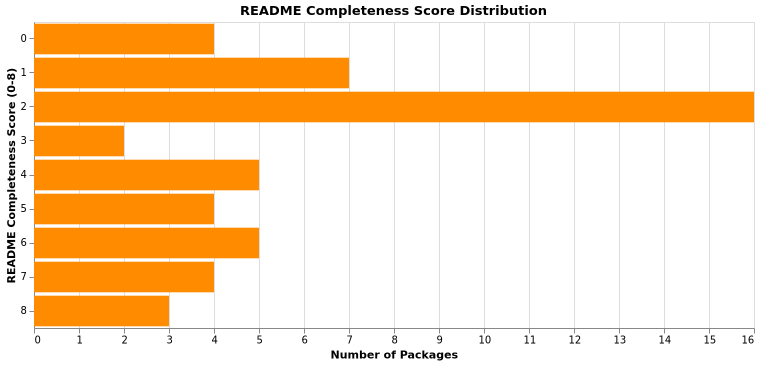

### Activity & Engagement

**Activity recency:** days since last push. Recent activity indicates active maintenance; older dates may indicate stable (no updates needed) or abandoned repos.

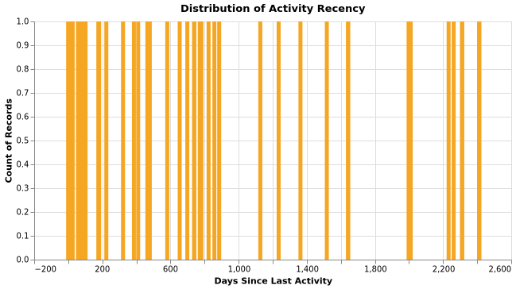

**Releases distribution:** spread of release counts across packages. More releases indicate active development and versioning discipline.

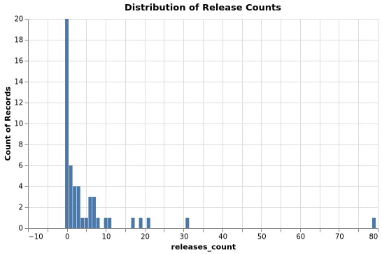

**Stars distribution:** how GitHub stars are spread across packages. Stars correlate with popularity and community interest.

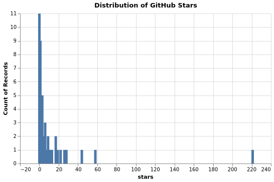

**Contributors distribution:** spread of human contributor counts. Shows whether packages have small maintainer teams or broad community involvement.

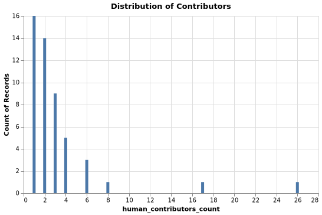

**Top 15 by stars:** most popular packages in the ecosystem.

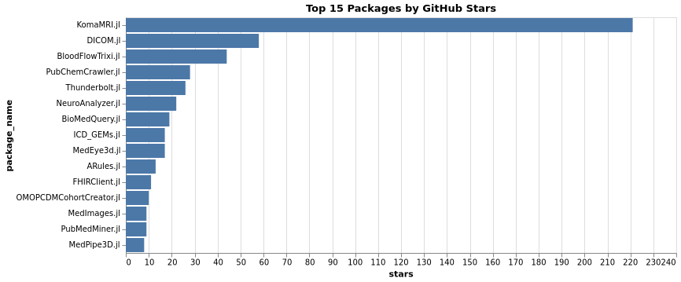

**Top 15 by monthly downloads:** most downloaded packages in the last 30 days.

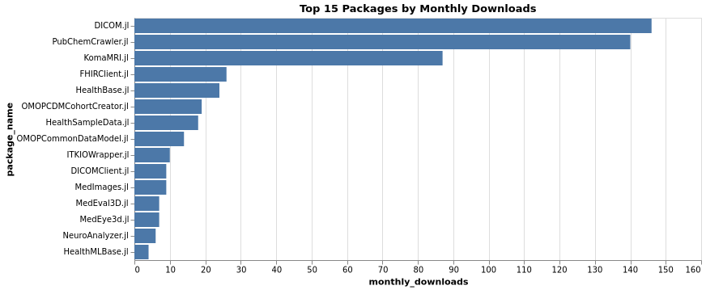

**Top 15 by total downloads:** most downloaded packages all-time.

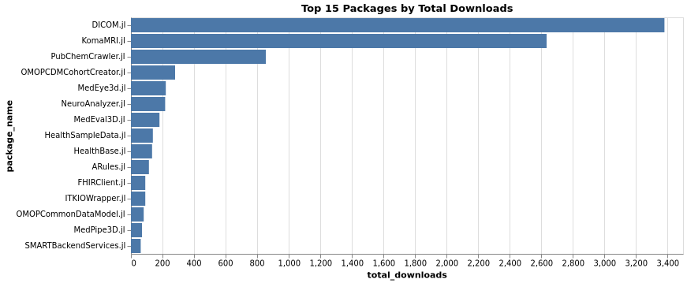

**Top 15 by contributors:** packages with the largest human contributor bases, indicating strong community engagement.

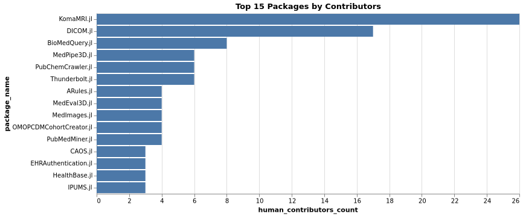

**Top releases:** packages with the most releases, showing active versioning and development velocity.

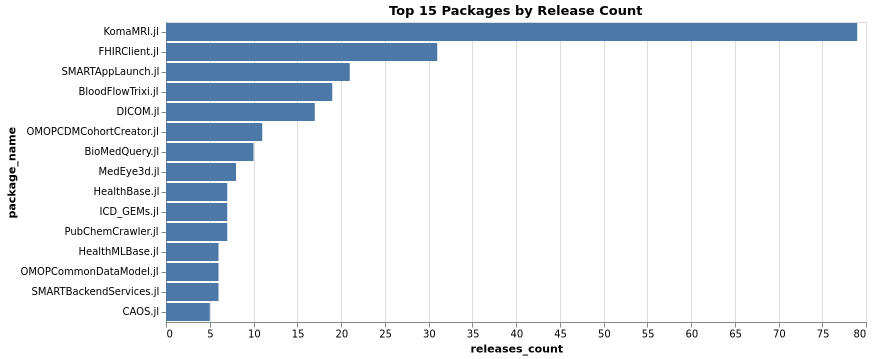

### Maintainers & Maintenance Status

**Maintainers comparison:** all maintainers with push/admin/maintain access vs active maintainers (contributed in last 6 months). Shows team depth and current availability.

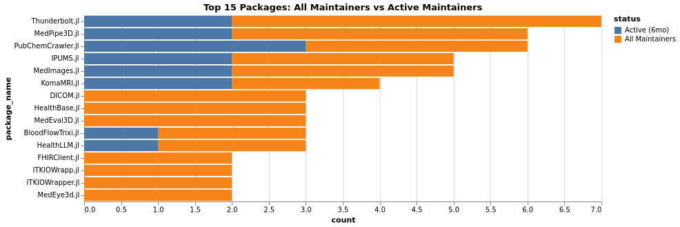

**Maintenance status:** distribution of Active/Inactive/Abandoned/Concept packages. Classification based on maintainer activity, release frequency, and commit recency.

| Status | Criteria |
| --- | --- |
| **Concept** | Less than 1 release |
| **Active** | Has active maintainers (contributed in last 6 months) |
| **Inactive** | Has maintainers but no active ones, last activity < 540 days (~18 months) |
| **Abandoned** | No maintainers OR last activity ≥ 540 days |

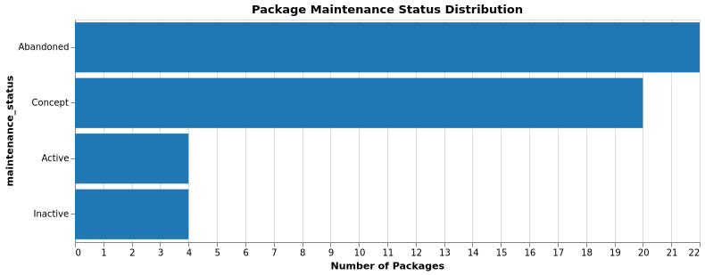

### Issues & PRs

**Issues comparison:** open vs closed issue counts across packages. Shows issue triage and maintenance responsiveness.

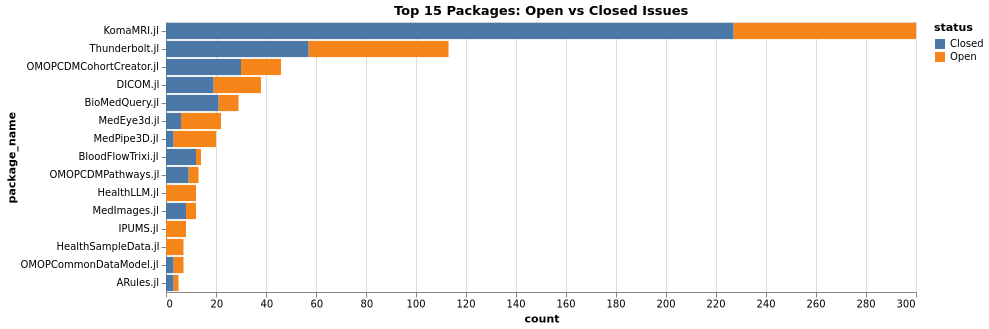

**PRs comparison:** open vs closed pull request counts. Indicates review backlog and community contribution velocity.

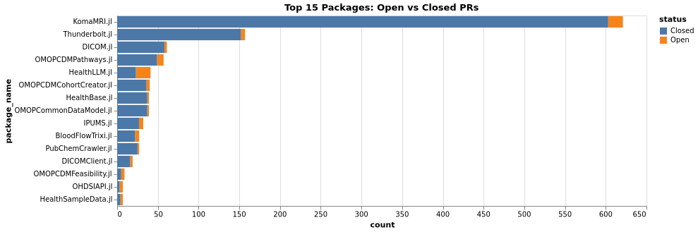

### Repository Status

**Archive status:** archived repos are read-only; indicates the project is no longer maintained or has been superseded.

 

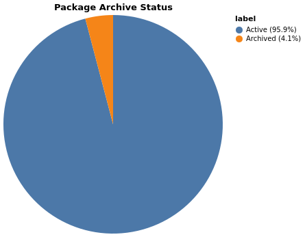

**Fork status:** whether repos are forks of other projects. Forks may have different maintenance models than original projects.

 

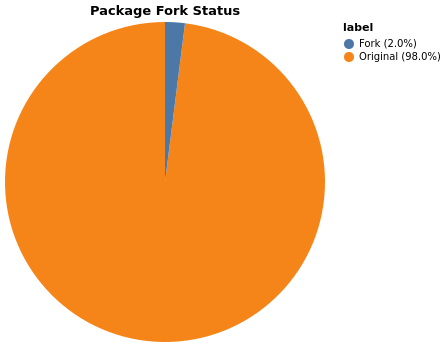

### Licensing

**License presence:** fraction of packages with explicit LICENSE files. License clarity is essential for legal compliance and community trust.

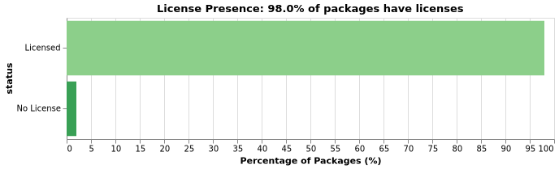

**License types:** distribution of SPDX license identifiers (MIT, Apache-2.0, GPL, BSD, etc.). Shows diversity of open-source approaches across the ecosystem.
 
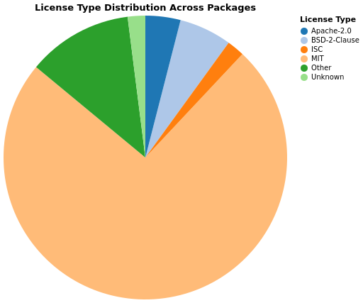

## Non-Packages

**Scope:** Documentation sites, tools, and other JuliaHealth repos without a `.jl` package. Metrics cover popularity (stars), contributors (humans vs bots), CI adoption, licensing, and activity on issues/PRs.

### Popularity & Contributors

**All stars:** total stars across non-package repositories, showing overall community interest in supporting resources.

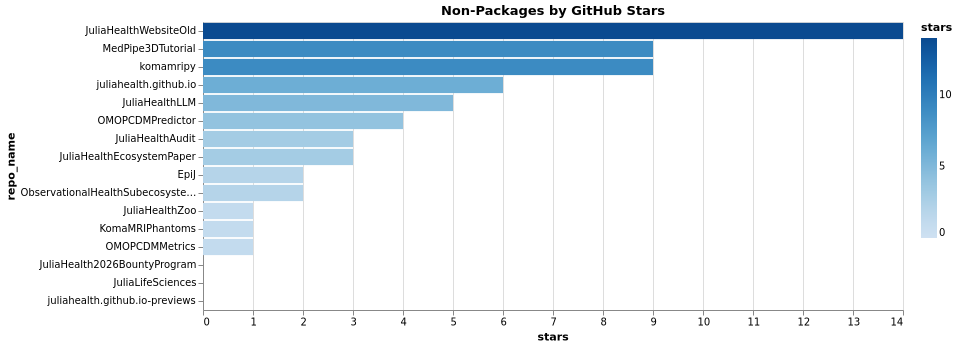

**All contributors:** human contributor counts across non-package repos, indicating collaboration on documentation, tools, and tutorials.

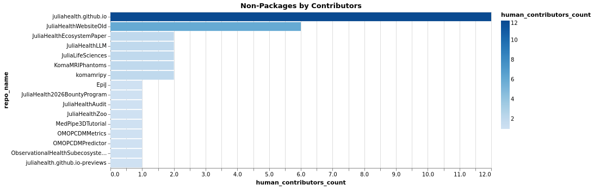

### CI/CD & Licensing

**CI adoption:** fraction of non-package repos with CI workflows. Automation is important for websites, docs, and tools to maintain quality.

 

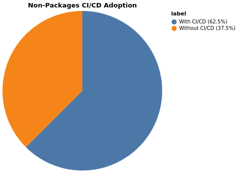

**License presence:** percentage of non-packages with explicit LICENSE files.

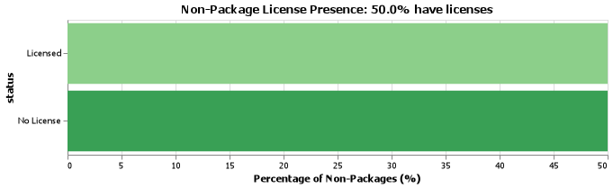

**License status:** breakdown of repos with vs without licenses.

 

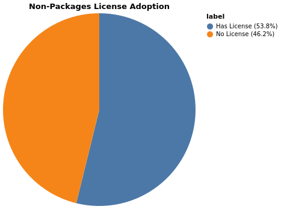

**License types:** distribution of open-source licenses used in non-package resources.

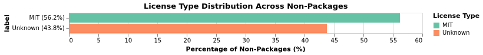

### Issues & PRs

**Issues comparison:** open vs closed issues across non-package repos.

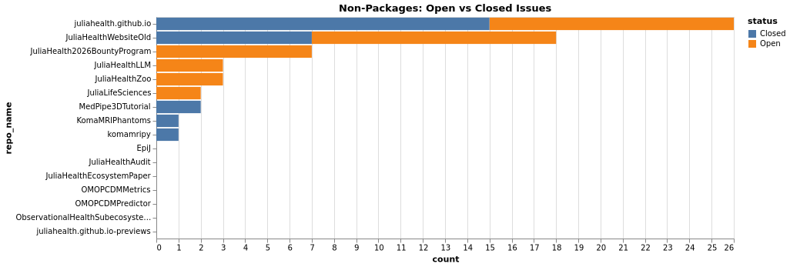

**PRs comparison:** open vs closed pull requests on non-package repos, showing contribution acceptance and review velocity.

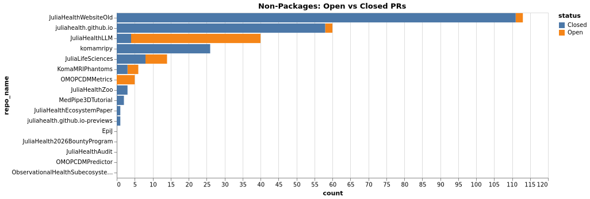

### Maintainers & Maintenance Status

**Maintainers comparison:** all maintainers with push/admin/maintain access vs active maintainers across non-package repositories.

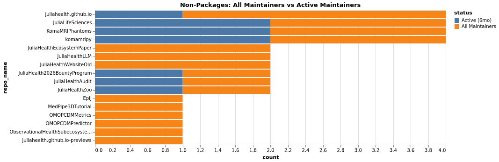

**Maintenance status:** distribution of maintenance states for non-package repos (Active/Inactive/Abandoned/Concept). Helps identify which tools and resources are actively maintained.

| Status | Criteria |
| --- | --- |
| **Concept** | Less than 1 release |
| **Active** | Has active maintainers (contributed in last 6 months) |
| **Inactive** | Has maintainers but no active ones, last activity < 540 days (~18 months) |
| **Abandoned** | No maintainers OR last activity ≥ 540 days |

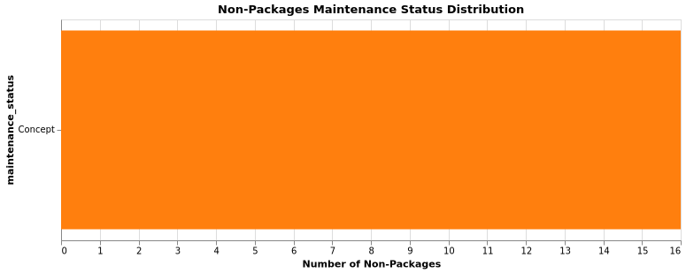

## Contributors (Cross-Ecosystem)

**What's measured:** Human contributors across all JuliaHealth repos. `total_contributions` is summed across all repos a person has touched; `num_repos_contributed` counts distinct JuliaHealth repos per contributor. Bots are excluded for cleaner metrics.

**Top contributors by total:** individuals with the highest contribution counts across the entire JuliaHealth ecosystem.

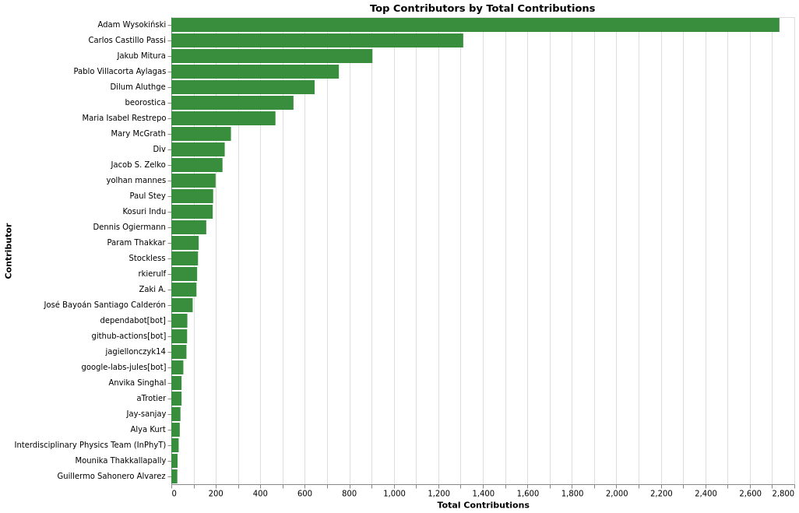

**Top contributors by repo count:** individuals contributing to the most distinct JuliaHealth repositories, indicating broad ecosystem involvement.

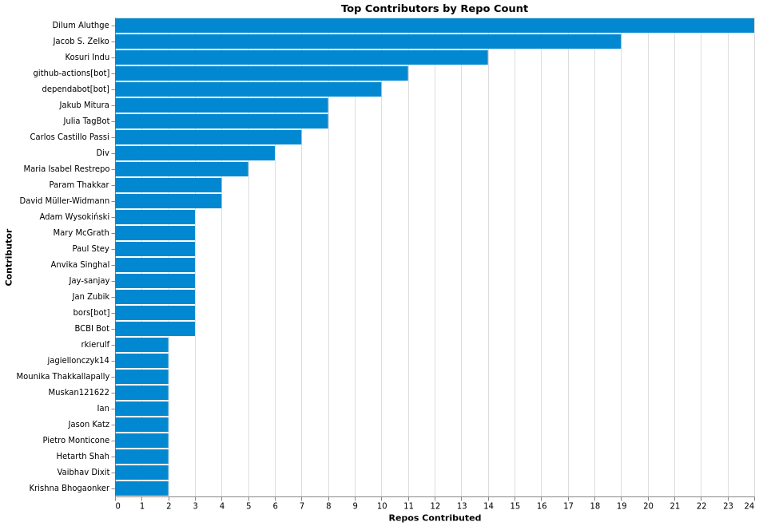

**Contribution distribution:** spread of contribution counts across all contributors, showing whether ecosystem work is concentrated or distributed.

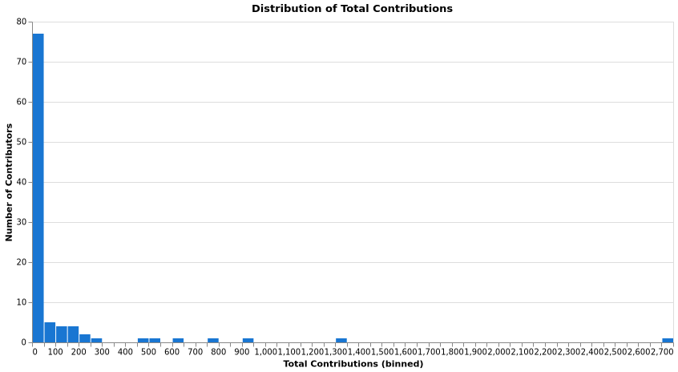

**Engagement tiers:** categorization of contributors by activity level (core/regular/occasional/one-time) derived from total contributions and repo breadth.

| Tier | Rule (total_contributions, num_repos_contributed) |
| --- | --- |
| Core | total > 500 **or** repos > 10 |
| Regular | total ≥ 100 **or** repos ≥ 3 |
| Occasional | total ≥ 10 **or** repos ≥ 1 |
| One-time | a one time contribution |

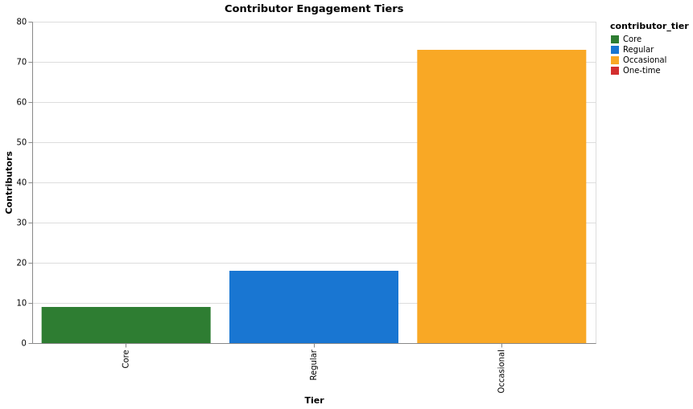
